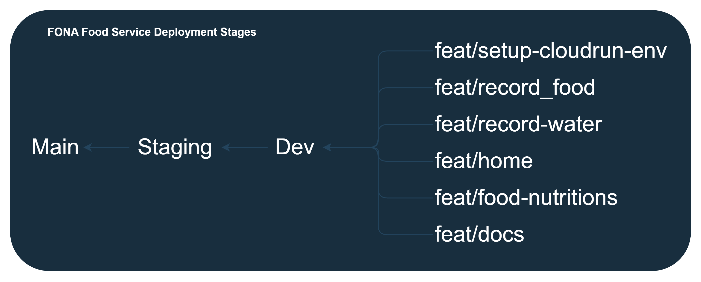

# 🔗 FONA's Food Service

`This food service provides a comprehensive suite of tools for users to record and manage their consumed foods and water.`

💡 The `main idea` of this service is to allow users to record their consumed foods and water, and calculate the nutritions of their foods.

🎯 The primary goal of this service is to calculate the nutritions of users recorded consumed foods

## Features

- ✅ Retrieve a List of Foods
- ✅ Retrieve Details for a Specific Food
- ✅ Retrieve the List of Nutrients for Foods
- ✅ Retrieve the List of Allergies
- ✅ Retrieve the User's Recorded Consumed Foods, Consumed Water, Daily Analysis, and Food Suggestions for the the User
- ✅ Store the Foods Consumed by the User
- ✅ Store the Water Consumed by the User
- ✅ Update the Water Consumed by the User

`✅ : Completed | ❌ : Not Completed | ⚒️ : In Progress`

## Technologies and Libraries

- ✅ [`NodeJS`](https://nodejs.org/) - JavaScript runtime environment to run the service
- ✅ [`NestJS`](https://nestjs.com/) - NodeJS framework used to facilitate the service development
- ✅ [`PostgreSQL`](https://www.postgresql.org/) - Database to store the foods and nutritions data
- ✅ [`Github Actions`](https://docs.github.com/en/actions) - Used for the development and production workflows

`✅ : Completed | ❌ : Not Completed | ⚒️ : In Progress`

## Project Structure

```
.
├── Dockerfile
├── README.md
├── nest-cli.json
├── package-lock.json
├── package.json
├── src
│   ├── app.module.ts
│   ├── common
│   │   ├── const
│   │   │   └── ... (consts)
│   │   ├── enum
│   │   │   └── ... (enums)
│   │   ├── filter
│   │   │   └── ... (exceptions)
│   │   ├── interceptor
│   │   │   └── ... (interceptors)
│   │   ├── message
│   │   │   └── ... (messages)
│   │   └── middleware
│   │       └── ... (middlewares)
│   ├── config
│   │   └── global.config.ts
│   ├── db
│   │   └── run-in-transaction.ts
│   ├── main.ts
│   ├── module
│   │   ├── allergy
│   │   │   ├── allergy.controller.ts
│   │   │   ├── allergy.module.ts
│   │   │   ├── allergy.service.ts
│   │   │   ├── dto
│   │   │   │   └── ... (DTOs)
│   │   │   └── models
│   │   │       └── ... (models)
│   │   ├── food
│   │   │   ├── dto
│   │   │   │   └── ... (DTOs)
│   │   │   ├── entities
│   │   │   │   └── ... (entities)
│   │   │   ├── food.controller.ts
│   │   │   ├── food.module.ts
│   │   │   ├── food.service.ts
│   │   │   └── models
│   │   │       └── ... (models)
│   │   ├── home
│   │   │   ├── dto
│   │   │   │   └── home.dto.ts
│   │   │   ├── entities
│   │   │   │   └── ... (entities)
│   │   │   ├── home.controller.ts
│   │   │   ├── home.module.ts
│   │   │   ├── home.service.ts
│   │   │   └── models
│   │   │       └── ... (models)
│   │   └── water
│   │       ├── dto
│   │       │   └── ... (DTOs)
│   │       ├── entities
│   │       │   └── ... (entities)
│   │       ├── models
│   │       │   └── ... (models)
│   │       ├── water.controller.ts
│   │       ├── water.module.ts
│   │       └── water.service.ts
│   └── util
│       └── ... (helpers)
├── test
│   ├── app.e2e-spec.ts
│   └── jest-e2e.json
├── tsconfig.build.json
└── tsconfig.json
```

| Directory      | Description                                                           |
| -------------- | --------------------------------------------------------------------- |
| `consts`       | Contains constant values used throughout the service                  |
| `enums`        | Houses enumerations, defining sets of named constant values           |
| `exceptions`   | Stores custom exception classes or error handling functionalities.    |
| `interceptors` | Holds code for intercepting and manipulating HTTP requests/responses. |
| `DTOs`         | Stores Data Transfer Objects used for communication between layers.   |
| `models`       | Contains data models representing entities within the service         |
| `helpers`      | Houses utility functions or classes                                   |

## Deployment Stages


